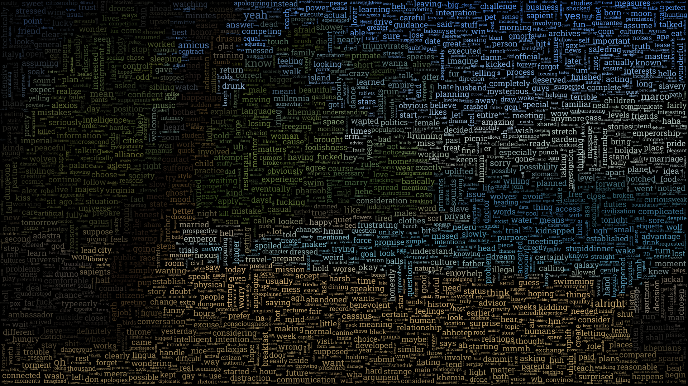
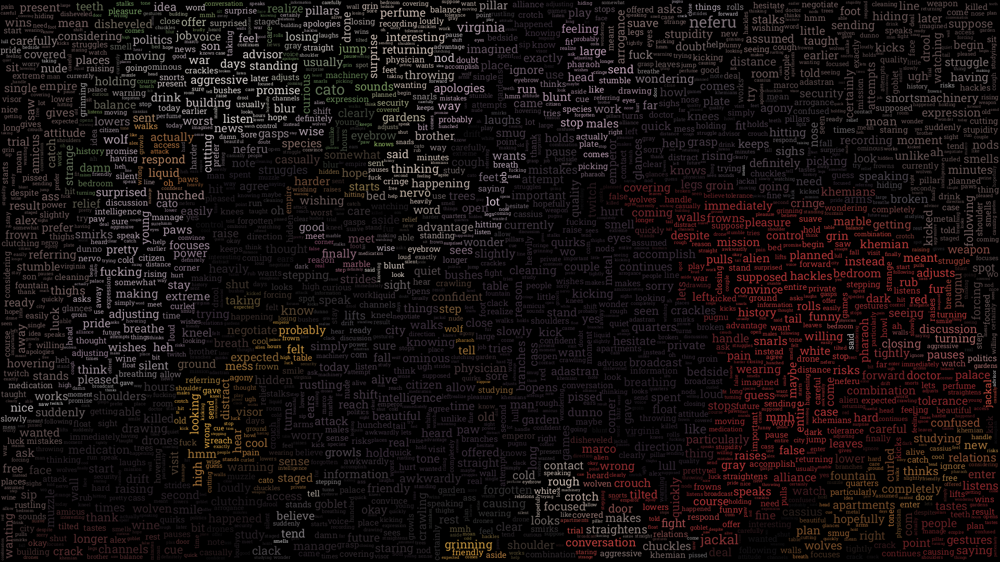
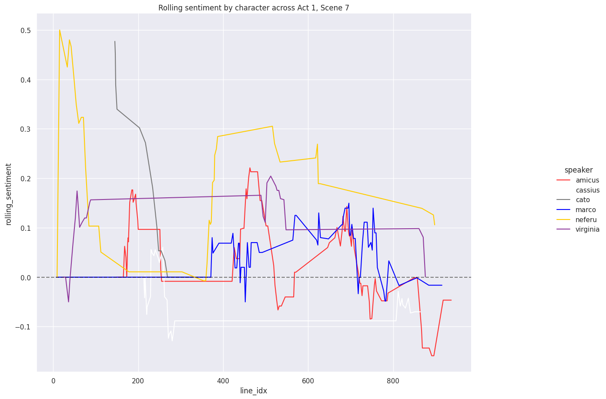

# adastra-analysis
TL;DR: What started as a goal to write the contents of the visual novel Adastra into screenplays has now become a ~two-week-long~ **two-month-long** project culminating in a system to dynamically interact with text and images from Adastra. I've created a set of scripts through which you can parse the game's files into a cleaned dataset and other generated files, including formatted screenplays, wordclouds, and relation plots.


-----

# Overview

Do you love the visual novel Adastra? Do you often reminisce about the time you spent there with best boy Amicus? Do you want to get a more intimate look at him and all the other kooky characters who try to kill you during your thirteen hours imprisoned in paradise?

By the gods, are you in luck! This code allows you to do the following:
- Collect and cleanse the internal script files of the game into a single dataset hydrated with metadata
- Query the dataset using SQL and output the results to disk
- Write the script files out as chapter-by-chapter screenplays, formatted by user-preference
- Recreate game illustrations and sprites as word clouds (customizable by speaker, file, etc.)
- Extract and save sentiment and aggregate statistics by speaker across chapter as relational plots

I'm sharing this code as is.  This presumes you hold a basic knowledge of Python and running it locally; please do not ask me for help resolving installation issues. StackOverflow will be far more helpful!

*Please do reach out to me if you encounter a bug while using the library! I have **not** done enough testing.*

*Note: This is currently the fourth iteration of this project. Version 0 was a set of Jupyter notebooks in which I built out test scripts to ingest and convert the dataset. I formalized the code into a library in version 1. I added YAML configs in version 2, and I added full YAML customization in version 3. Version 4 was a code refactoring to try to minimize code duplication and to use better object-oriented classes and inheritance. I could probably continue to work on this code for the foreseeable future, but to be honest I'm tired and want to do something else. Apart from additional testing and bug-fixing, this code should be considered complete.*


# FYI

Adastra contains a total of 15,577 lines across 14 chapters of content, translating to 219,937 words in total. Given the mutual-exclusivity of optional choices and end-games, a player will consume roughly 180,907 words across a typical playthrough.

The average Harry Potter book is 250 words per page; the average Brandon Sanderson novel is 350. This means that the average playthrough of Adastra is between *516 and 723 pages* of content, depending on your preference of page-density.

I have reached out to Howly for permission to share the formatted full text contents of the game. ~~Until I receive a response, I'm not including the screenplays or cleaned dataset in this library. It'll have to be generated from your end. If I receive permission in the future (or if someone can educate me on licensing to prove this content is already freely available to share), I will add these files to the repo.~~ Update: I still have not received explicit permission, but another Redditor has clarified for me that this content is shareable under RenPy and Itch.io licenses. These have been included in three different styles in the repo.

Example wordclouds are found in `examples/wordclouds`. Example relational plots are found in `examples/relplots`. Example query outputs are found in `examples/queries`. Example screenplays are found in `examples/screenplays`.

Read on to learn how you can play with this data yourself!

-----



-----


# Setup

Create a new environment in which to play with this code (e.g. using `venv`). A `requirements.txt` file has been included to try to circumvent dependency errors.

Download the latest Linux version of Adastra. Unzip the directory and put it somewhere easily accessible.

All functionality of this library is completed using the following command:
```
python -m adastra_analysis [--configs CONFIGS_PATH]
```
Attempt to run this command before changing any configs or running any subroutines.

All logic for this library's outputs is derived from a single YAML config file. This is where you can specify exactly how you want to interact with the dataset, as well as how you want to output your queries, relplots, screenplays, and wordclouds. By default, this is defined within the library at `adastra_analysis_configs.yaml`; you can specify another path using `--configs`.

Example runs are already filled into the configs. You can comment these out (`Ctrl + /` on most modern IDEs) and add your own, or customize them as you see fit.

*Note: I've put a lot of work into building out a default set of Runs that are extensible and easily editable. As such, I've used a number of higher-level YAML concepts like [anchors/aliases](https://support.atlassian.com/bitbucket-cloud/docs/yaml-anchors/) and [merge-keys](https://yaml.org/type/merge.html). Please refer to the YAML documentation (and again StackOverflow) to understand some of the intricacies of what I've done.*

Below, I will document the structure of the configs file and suggestions for using it to interact with the library.


-----


*Cassius and Alexios may both be assholes, but they do make a cute couple...*

-----


## Datasets

Before you can run the script, you must build the required datasets. These are defined under the `datasets` subheader in the configs file. Use the following command to build and save the datasets to disk:
```
python -m adastra_analysis build [--datasets [dataset1 [dataset2 ...]]]
```

An explicit list of dataset keys can be specified to recreate; if none are specified, all are created. These datasets are always read from disk during Runs (discussed later on). I have predefined two classes of dataset logic.

### AdastraDataset

The main logic for collecting and transforming the raw Adastra game files into a DataFrame is classifying using the `AdastraDataset` object. An AdastraDataset has the following required configurations:

```
!AdastraDataset
name          : key to dataset, accessible via `--datasets name`
file          : output path for the dataset .jsonl file
adastra_dir   : the path to the unzipped Adastra game directory
main_character: (default "Marco"); the chosen name of the main character in the dataset
use_nlp       : (default False)  ; boolean flag for whether to include optional NLP content in the dataset

```

One example of an AdastraDataset named `adastra` has already been predefined in the configs. This dataset contains the text of each line, its file and line idx, and metadata for querying its contents. By default, the dataset contains these columns:

| Column | Type | Description |
| ------ | ---- | ----------- |
| file | str | name of source file |
| line_idx | int | line number within the file |
| category | enum | line category (among a predefined set of enumerations) |
| speaker | str | character/source of the line (includes 'internal_narration' and 'speaker_unspecified') |
| line | str | cleaned text of the line |
| is_renpy | bool | is the line internal Ren'Py-logic? |
| is_choice | bool | is the line a split to multiple branches (a player choice or conditional Python logic)? |
| is_read | bool | is the line text read by the player? |
| has_speaker | bool | is the line spoken by a named speaker (not internal narration or an unspecified speaker)? |
| is_branch | bool | is the line an optional branch (delineated by a choice)? |
| raw | str | raw text of the line as found in the game files |


Additionally, I have included optional basic natural language processing (NLP) functionality that can extend the dataset. These are the additional NLP columns:

| Column | Type | Description |
| ------ | ---- | ----------- |
| sentiment | [-1, 1] | sentiment of the line (negative to positive) |
| subjectivity | [0, 1] | subjectivity (strength) of the sentiment |
| sentences | str | sentences in the line, joined by newlines |
| num_sentences | int | number of sentences |
| words | str | non-punctuation words in the line, joined by spaces |
| num_words | int | number of extracted words |
| content_words | str | lowercased non-stop/filler words in the line, joined by spaces |
| num_content_words | int | number of extracted content words |


To extend the dataset with NLP, set the `use_nlp` flag in the dataset's configs to `True`.

-----

### Dataset

Additional custom datasets can be defined and used throughout the script. The goal of this functionality is to allow basic joins to be used in the SQL queries and relplots.

A `Dataset` is a DataFrame of data defined in the configs file, read in from a local filepath, or built using SQL transformations on a preexisting dataset. A Dataset has the following set of configurations:
```
!Dataset
name        : key to dataset, accessible via `--datasets name`
file        : output path for the dataset .jsonl file; used as an input path if no optional params are specified below

# OPTION 1
dataset_args: (OPTIONAL) data to build a dataset manually
  columns   : names of the dictionary columns defined in `data`
  data      : a dictionary of keys and values to save as the dataset

# OPTION 2
sql         : (OPTIONAL) a SQL query to run on other predefined datasets
filters     : (OPTIONAL) SQL where-clause filters to apply to specific predefined datasets
  - name    : name of the predefined dataset to apply the filter to
    where   : SQL where-clause to apply to the named dataset
```

Every Dataset that will be passed into runs must be predefined in `datasets` with a name and file defined. There are additional parameters when defining a Dataset that combine to allow better customization. If no `sql` or `dataset_args` keys are present, the content at `file` will be attempted to be read as a DataFrame.

If `dataset_args` is defined, a dataset will be created using the manual data found under the args.

If `sql` is defined, a SQL query will be run using predefined datasets. An optional `filters` key specifies where-clause filters on specific datasets to be run prior to the SQL. (This allows cleaner YAML to be defined in the configs file.)

A Dataset object is required in every Run (outlined in the next section). The `!Dataset` YAML constructor is only used to define datasets to be prebuilt and saved, not those used dynamically in Runs. 99% of the time, you will be using SQL to define custom run datasets using the prebuilt datasets defined in `datasets`.

One example of a dataset named `characters` has already been predefined in the configs. This is a mapping between character names to their color codes used when building relation plots.


-----


*Neferu and Cato: the ship that no one asked for...*

-----

## Run

A Run is extended logic to generate a new file from the prebuilt datasets. These are the meat and potatoes of this library.

There are four types of Runs I have designed. The functionality of each is defined in the configs file.

To run the processes:

```
python -m adastra_analysis run [--queries] [--relplots] [--screenplays] [--wordclouds]
```

If no arguments are specified after `run`, all runs in the configs file will be run.

*Regardless of what is selected, run types will be completed in order of fastest-to-slowest in terms of completion time (the order listed above).*


All runs are specified under their own separate subheaders in the configs file. Under each run name, a sandbox area is provided for YAML anchors that define variables used in the runs. (These are ignored by the YAML parser.)

-----

### Queries
Define SQL statements to query against the datasets. The outputs of these are saved as JSON-lines.

Names of specific queries can be provided on the command line. Otherwise, all are run.
```
python -m adastra_analysis run --queries [query1 [query2 ...]]
```

Each run should be prefaced with `!Query`.
```
queries:

  [YAML DEFINITIONS SANDBOX]

  queries:

    - !Query
      name   : key to query, accessible via `--queries name`
      file   : output path for Query .jsonl file
      dataset: dataset of the query
```

*(See `examples/queries` for a predefined list of generated queries.)*


-----

### Relational Plots
Create custom relational plots using SQL queried against the datasets. These are saved as PNG files.

Names of specific relplots can be provided on the command line. Otherwise, all are run.
```
python -m adastra_analysis run --relplots [relplot1 [relplot2 ...]]
```

These are defined in `adastra_analytics.relplots` in the configs file.

Relplot arguments are entirely customizable based on standard Seaborn relplot kwargs. See [here](https://seaborn.pydata.org/generated/seaborn.relplot.html) for the Relplot source code (to get a feel for the kwargs).

```
relplots:

  [YAML DEFINITIONS SANDBOX]

  relplots:

    - !Relplot:
      name           : key to query, accessible via `--relplots name`
      file           : output path for Relplot .png file
      dataset        : dataset for the relplot
      relplot_args   : custom `seaborn.relplot` kwargs to define the relplot
      figsize        : (default (16, 10))  ; the size of the relplot figure
      title          : (default None)      ; a custom title for the relplot
      style          : (default 'darkgrid'); the background style of the relplot
      axhline        : (default None)      ; height of a horizontal line applied to the relplot
      remove_outliers: (default False)     ; apply smoothing to the output by filtering y data within within three-sigmas

```

*(See `examples/relplots` for a predefined list of generated plots.)*





-----

### Screenplays
The text contents of Adastra are cleaned into formatted screenplays, separated by chapter. Specify formatting by line-type using where-filters. Screenplays are saved as TXT files in a specified folder.

Names of specific screenplays can be provided on the command line. Otherwise, all are run.
```
python -m adastra_analysis run --screenplays [screenplay1 [screenplay2 ...]]
```

These are defined in `adastra_analytics.screenplays` in the configs file.
```
screenplays:

  [YAML DEFINITIONS SANDBOX]

  screenplays:

    - !Screenplay
      name          : key to query, accessible via `--screenplays screenplay_style1`
      folder        : output subfolder under {output_directory}
      dataset       : dataset for the screenplay
      justify       : how wide should the output be (justify-width)
      line_sep      : how should lines be separated
      file_col      : name of the column to split into files based on unique values
      screenplay_col: name of the column to output formatting to

      contexts:
        - name               : name of the category; only used to track progress
          where              : where-clause to filter which lines use the given category style
          justify            : (optional) custom justify-width that overwrites the screenplay-global one defined above
          style              : shape of the output with columns used (i.e. "{column1}: {column2}")
          textwrap_offset    : (default 0); how far should wrapped text be indented; defaults to 0

          columns:
            - name           : name of the column to be inserted into the style
              screenplay_args: formatting arguments to apply the the text of the column

```

*(I've created three versions of outputs already. If someone has a better idea for how to best improve readability for the output, please let me know!)*

#### style1
```
Amicus turns his head to look at me again, then looks away, letting out
another groan.

AMICUS
  "Ohh, my stomach. What did you do?"

MARCO
  "Exactly what you did to me."

I hold up my taser, turning it in the light so that the wolf can fully see
it.

Amicus stares at it for a moment before letting his face fall back to the
floor of the deck.

AMICUS
  "Oh Gods, I feel like I'm on fire...did you use it at full power? What
the hell is wrong with you!?"
```

#### style2
```
Amicus turns his head to look at me again, then looks away, letting out
another groan.

AMICUS: "Ohh, my stomach. What did you do?"

MARCO: "Exactly what you did to me."

I hold up my taser, turning it in the light so that the wolf can fully see
it.

Amicus stares at it for a moment before letting his face fall back to the
floor of the deck.

AMICUS: "Oh Gods, I feel like I'm on fire...did you use it at full power?
    What the hell is wrong with you!?"
```

#### style3
```
Amicus turns his head to look at me again, then looks away, letting out
another groan.

               AMICUS
               "Ohh, my stomach. What did you do?"

               MARCO
               "Exactly what you did to me."

I hold up my taser, turning it in the light so that the wolf can fully see
it.

Amicus stares at it for a moment before letting his face fall back to the
floor of the deck.

               AMICUS
               "Oh Gods, I feel like I'm on fire...did you
               use it at full power? What the hell is wrong
               with you!?"
```

~~*(I have chosen to forgo including any example screenplays in the library until I receive express permission from one of the creators of Adastra. These will have to be generated on your end for the time being.)*~~

*(See `examples/screenplays` for three predefined styles of screenplays.)*


-----


### Wordclouds
Save custom wordclouds based off of subsets of dialogue text and masked over specific images (both from the game and external). These can be populated by lines from a specific where-filter of the data (e.g. only text from a specific file, only text spoken by Amicus, etc), or even by specific scenes if you know the file and line numbers. Wordclouds are saved as PNG files.

Names of specific wordclouds can be provided on the command line. Otherwise, all are run.
```
python -m adastra_analysis run --wordclouds [wordcloud1 [wordcloud2 ...]]
```

These are defined in `adastra_analytics.wordclouds` in the configs file.

By default, a customized TF-IDF algorithm is used to generate aggregated word-frequencies for the wordclouds. The TF portion is built using sklearn's `CountVectorizer`; this is customizable via user-provided kwargs.  See [here](https://scikit-learn.org/stable/modules/generated/sklearn.feature_extraction.text.CountVectorizer.html) for the CountVectorizer source code (to get a feel for the kwargs).

*Note: I will not claim this has been coded correctly, but the wordclouds look nice, so I'm keeping it as is.*

Wordcloud arguments are entirely customizable based on `wordcloud.Wordcloud` kwargs. I've set up a nice set of defaults, but feel free to test further! See [here](https://github.com/amueller/word_cloud/blob/master/wordcloud/wordcloud.py) for the Wordcloud source code (to get a feel for the kwargs).

```
wordclouds:

  [YAML DEFINITIONS SANDBOX]

  wordclouds:

  - !Wordcloud
     name                : key to query, accessible via `--wordclouds wordcloud1`
     file                : output path for wordcloud
     dataset             : dataset to build term frequencies out of for the wordcloud
     image               : path to image mask
     where               : where-clause to subset term frequencies used in the wordcloud
     documents_col       : text column to use for building term frequencies
     countvectorizer_args: `sklearn.CountVectorizer` kwargs to use when building the term frequencies
     wordcloud_args      : `wordcloud.Wordcloud` kwargs to define the wordcloud
```

*(See `examples/wordclouds` for a predefined list of generated clouds.)*

-----

### Conclusion

This documentation is incomplete, but it's more than enough to get started! I'll continue to document and test/bug-fix the project in the coming weeks. I've had a lot of fun building this out, and I hope that someone else gets use out of all this work. Regardless, enjoy the example wordcloud images I've shared! Please reach out to `u/OrigamiOtter` for questions and feedback!


